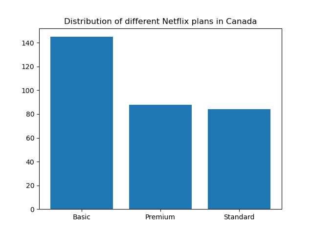

# 📋 Netflix Userbase analytics

# 👩‍💻 Scenario
In order to understand and find what optimizations or issues should be done and fixed in an online platform like Netflix, understanding the users and their operations, locations, or preferences can give insights and general ideas about the platform and how it should adapt to fit all the users and their interactions, this is why I have decided to analyze the Netflix userbase and answer some questions about it.

# 📚 Data
The data used is the Netflix userbase dataset found in this <a href="https://www.kaggle.com/datasets/arnavsmayan/netflix-userbase-dataset">link</a>

# 🎯 Goals
The goals of these analytics are answering the following questions:
- How are plan subscriptions spread accross Netflix users in each country?
- What are the top 3 age groups of Netflix users?
- What are the most used 3 devices by Netflix users globally and what is the most used device in each country?

# 🛰️ Highlights
- While working on finding how are plan subscriptions spread accross Netflix users in each country, I was able to conclude the following function that helps in answering the question by only specifying the name of the target country:
```def plans_in(country):
    x = data[data.Country == country]["Subscription Type"].value_counts().sort_values(ascending=False)
    indices = [0, 1, 2]
    plt.bar(x.index, x.iloc[indices])
    plt.title(f"Distribution of different Netflix plans in {country}")
    plt.show()
```
Here is the output of the function when used with Canada:


# 🛠️ Tools
The tools mainly used in this project are ```matplotlib``` and ```pandas```

# 🧪 Using this repository

- Use the ```Visualizations``` directory to find the hghlighted visualizations in this project

- To clone the repository, make sure you have ```pandas``` and ```matplotlib``` installed in your environement

- To do so using ```pip``` run the following command: <br>
```pip install pandas matplotlib``` <br> <br>

- For ```Conda``` run this: <br>
```conda install pandas matplotlib``` <br>
